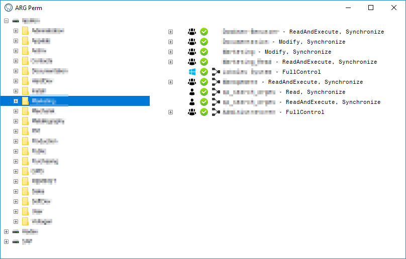

# Project Title

A program to view the access rights of server shares. Lists the AD groups and users and the associated rights.




## Getting Started

These instructions will get you a copy of the project up and running on your local machine for development and testing purposes. See deployment for notes on how to deploy the project on a live system.

### Prerequisites

What things you need to install the software and how to install them

```
Active Directory
```

### Installing

No installation necessary.
Download the Release and start the ArgPerm.exe


## Built With

* [Visual Stuio 2017](https://visualstudio.microsoft.com/de/)

## Contributing

Please read [CONTRIBUTING.md](https://gist.github.com/PurpleBooth/b24679402957c63ec426) for details on our code of conduct, and the process for submitting pull requests to us.

## Versioning

We use [SemVer](http://semver.org/) for versioning. For the versions available, see the [tags on this repository](https://github.com/Obilarius/Arges_ArgPerm/tags). 

## Authors

* **Sascha Walzenbach** - *Initial work* - [Obilarius](https://github.com/Obilarius)

See also the list of [contributors](https://github.com/Obilarius/Arges_ArgPerm/contributors) who participated in this project.

## License

This project is licensed under the MIT License - see the [LICENSE.md](LICENSE) file for details
